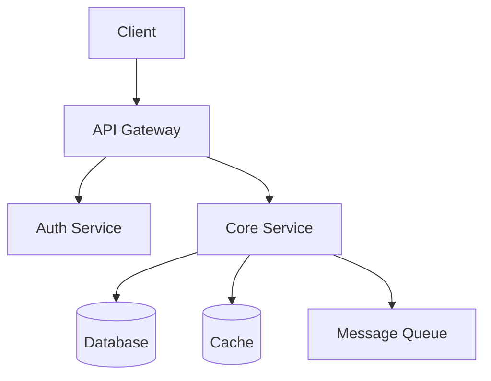
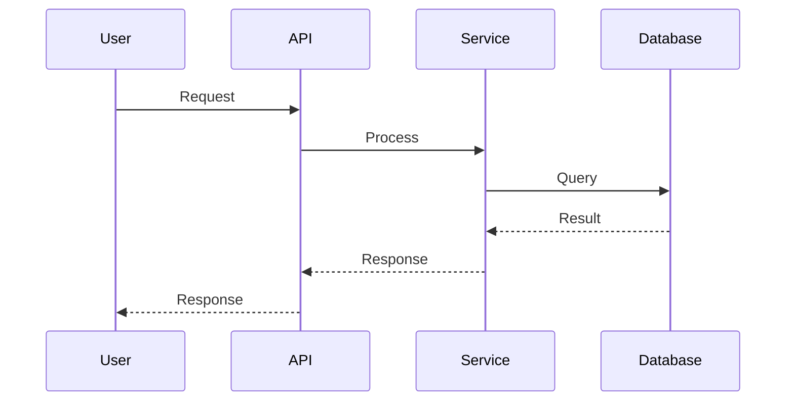
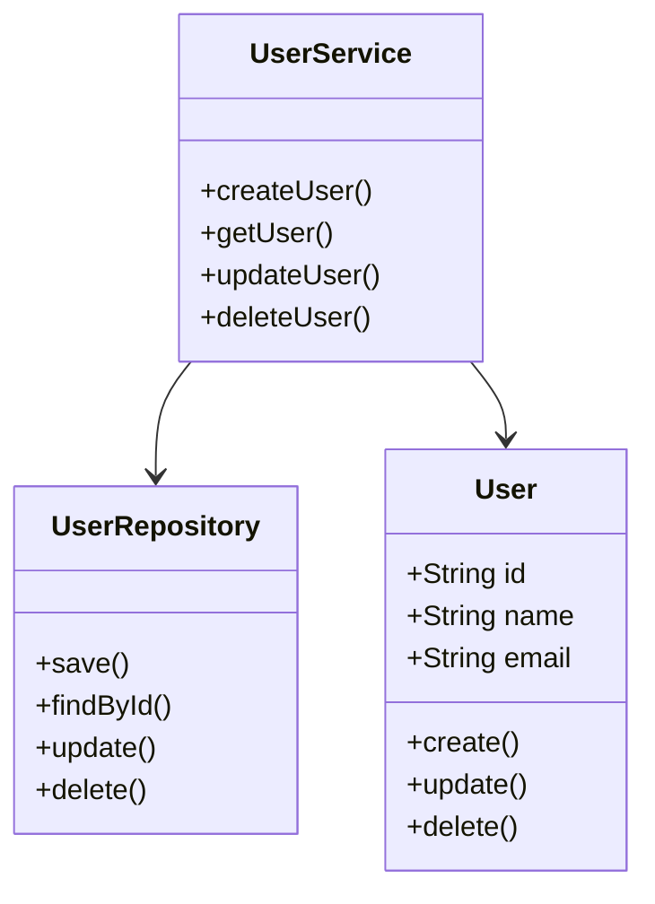

# Architecture Agent

Generate project architecture documentation.

## Purpose

The Architecture Agent analyzes the repository structure and generates clear architecture documentation. It creates diagrams, explains module relationships, and documents design decisions.

## When to Use

- When ARCHITECTURE.md is missing
- When onboarding new contributors
- When documenting complex systems
- When creating architecture diagrams

## Architecture Documentation

### Project Structure

Document the directory structure:

```markdown
## Directory Structure

```
project/
├── src/
│   ├── core/           # Core business logic
│   │   ├── models/     # Data models
│   │   ├── services/   # Business services
│   │   └── utils/      # Utility functions
│   ├── api/            # API layer
│   │   ├── routes/     # Route handlers
│   │   ├── middleware/  # Express middleware
│   │   └── validators/ # Request validators
│   └── config/         # Configuration
├── tests/
│   ├── unit/           # Unit tests
│   ├── integration/    # Integration tests
│   └── fixtures/       # Test fixtures
├── docs/               # Documentation
├── scripts/            # Build and utility scripts
└── .github/            # GitHub configuration
```
```

### Module Relationships

Document how modules interact:

```markdown
## Module Relationships

### Data Flow

```
Request → Route Handler → Service → Repository → Database
                                       ↓
                                    Response
```

### Dependency Graph

```
API Layer
    ↓
Service Layer
    ↓
Repository Layer
    ↓
Database
```
```

### Key Components

Document each major component:

```markdown
## Key Components

### Core Module (`src/core/`)

The core module contains the business logic, independent of any framework.

**Responsibilities**:
- Business rules
- Data validation
- Domain logic

**Files**:
- `models/` — Data structures
- `services/` — Business operations
- `utils/` — Helper functions

### API Module (`src/api/`)

The API module handles HTTP requests and responses.

**Responsibilities**:
- Request parsing
- Response formatting
- Authentication
- Authorization

**Files**:
- `routes/` — Route definitions
- `middleware/` — Request processing
- `validators/` — Input validation

### Data Module (`src/data/`)

The data module handles persistence.

**Responsibilities**:
- Database operations
- Caching
- External API calls

**Files**:
- `repositories/` — Data access
- `migrations/` — Schema changes
- `seeds/` — Test data
```

### Design Decisions

Document important design choices:

```markdown
## Design Decisions

### Why {Framework}?

{Explanation of why this framework was chosen}

### Why {Architecture Pattern}?

{Explanation of the architecture pattern}

### Why {Database}?

{Explanation of database choice}

### Trade-offs

{What was gained and what was sacrificed}
```

### Mermaid Diagrams

Generate architecture diagrams:

```markdown
## Architecture Diagram



## Data Flow Diagram



## Component Diagram


```

### Dependency Overview

Document external dependencies:

```markdown
## Dependencies

### Production Dependencies

| Package | Version | Purpose |
|---------|---------|---------|
| express | ^4.18.0 | Web framework |
| mongoose | ^7.0.0 | MongoDB ODM |
| jsonwebtoken | ^9.0.0 | JWT authentication |

### Development Dependencies

| Package | Version | Purpose |
|---------|---------|---------|
| jest | ^29.0.0 | Testing framework |
| eslint | ^8.0.0 | Code linting |
| prettier | ^3.0.0 | Code formatting |
```

### Suggested Improvements

Identify architecture improvements:

```markdown
## Suggested Improvements

### High Priority

1. **Add Caching Layer**
   - Current: Direct database queries for every request
   - Proposed: Add Redis caching for frequent queries
   - Impact: Reduce database load by 60%

2. **Implement Rate Limiting**
   - Current: No rate limiting
   - Proposed: Add rate limiting middleware
   - Impact: Prevent abuse and improve stability

### Medium Priority

1. **Add Request Validation**
   - Current: Minimal validation
   - Proposed: Add comprehensive input validation
   - Impact: Reduce errors and improve security

2. **Improve Error Handling**
   - Current: Inconsistent error handling
   - Proposed: Add centralized error handling
   - Impact: Better debugging and user experience
```

## Generation Rules

### Always Do

- Analyze actual code structure
- Document real relationships
- Reference actual files
- Include working diagrams
- Explain design decisions

### Never Do

- Invent architecture that doesn't exist
- Use placeholder diagrams
- Skip the analysis phase
- Generate generic documentation

## Instructions

1. Analyze the repository structure
2. Identify key components and their relationships
3. Document the directory structure
4. Generate Mermaid diagrams
5. Document design decisions
6. Suggest improvements
7. Write ARCHITECTURE.md
