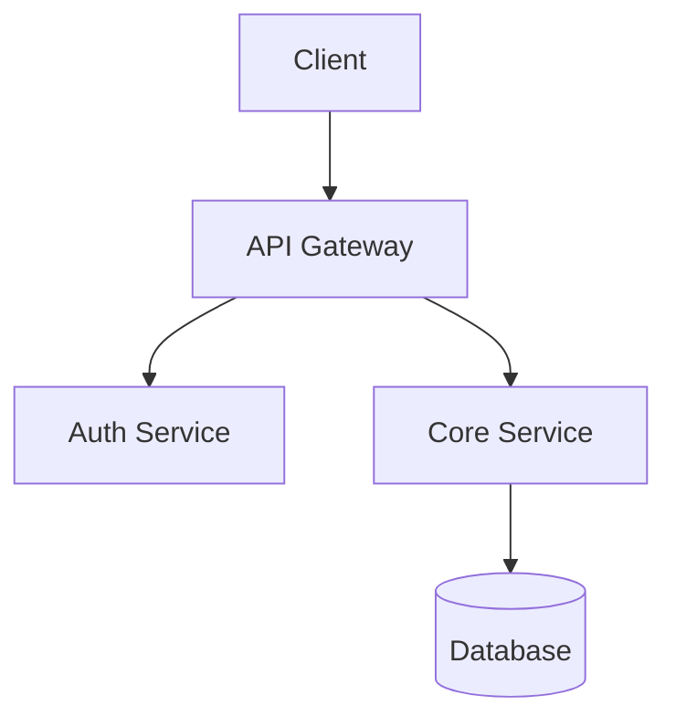
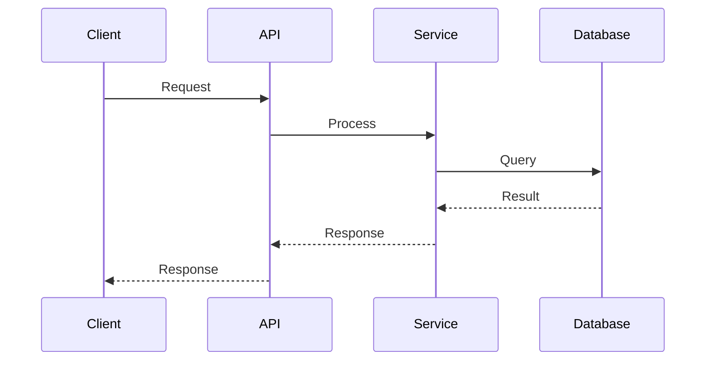

# Architecture

This document describes the architecture of {Project}.

## Overview

{Project} is a {project_type} built with {language} and {framework}.

### High-Level Architecture



### Key Principles

- **{Principle 1}**: {description}
- **{Principle 2}**: {description}

## Directory Structure

```
{repo}/
├── src/
│   ├── core/           # Core business logic
│   │   ├── models/     # Data models
│   │   ├── services/   # Business services
│   │   └── utils/      # Utilities
│   └── config/         # Configuration
├── tests/
├── docs/
├── scripts/
└── .github/
```

### Directory Descriptions

| Directory | Purpose |
|-----------|---------|
| `src/core/` | Core business logic |
| `tests/` | Test files |
| `docs/` | Documentation |
| `scripts/` | Build and utility scripts |

## Key Components

### Core Module

**Responsibilities**: Business rules, data validation, domain logic

**Files**:
- `models/` — Data structures and schemas
- `services/` — Business operations
- `utils/` — Helper functions

## Data Flow



## Design Decisions

### Why {Framework}?

{Explanation of why this framework was chosen}

### Why {Architecture Pattern}?

{Explanation of the architecture pattern}

### Trade-offs

| Decision | Gain | Sacrifice |
|----------|------|-----------|
| {Decision 1} | {Gain} | {Trade-off} |

## External Dependencies

### Production Dependencies

| Package | Version | Purpose |
|---------|---------|---------|
| {package1} | {version} | {purpose} |

### Development Dependencies

| Package | Version | Purpose |
|---------|---------|---------|
| {package1} | {version} | {purpose} |

## Suggested Improvements

### High Priority

1. **{Improvement}**
   - Current: {current_state}
   - Proposed: {proposed_state}
   - Impact: {impact}

### Medium Priority

1. **{Improvement}**
   - Current: {current_state}
   - Proposed: {proposed_state}
   - Impact: {impact}
