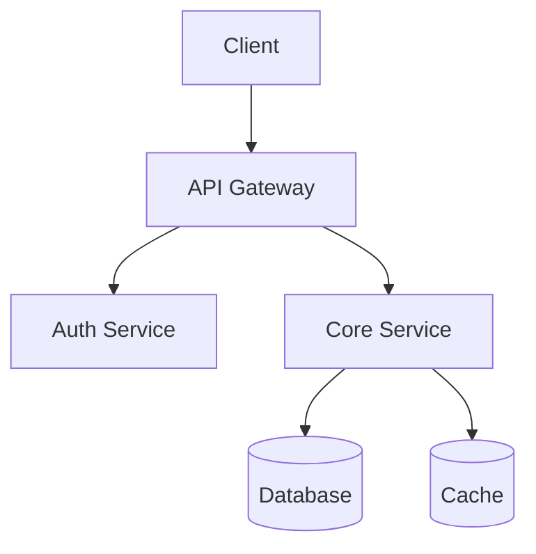
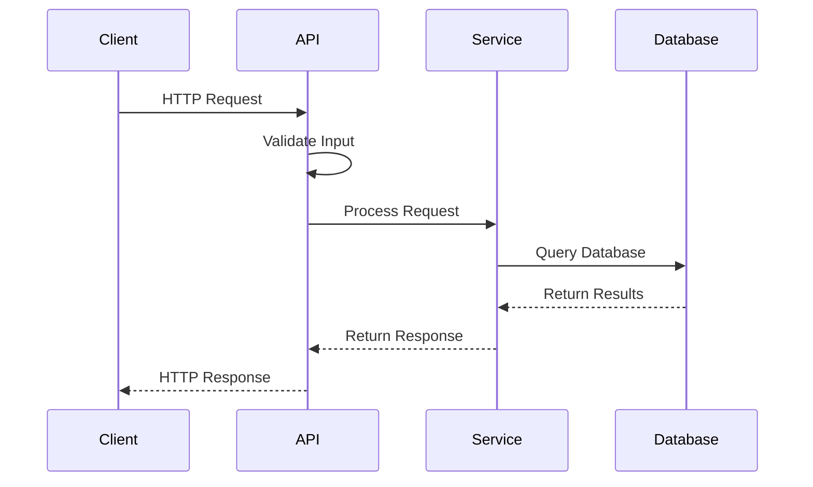
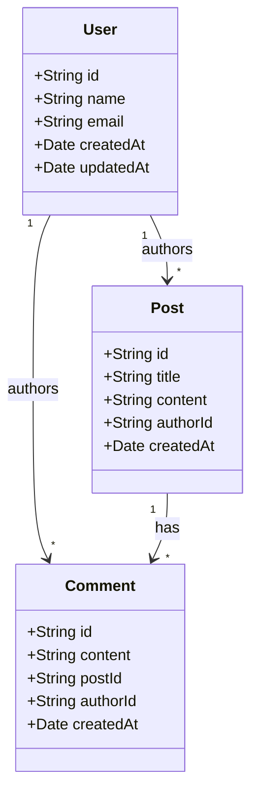

# Architecture Template

Use this template as a starting point. Customize it for your specific project.

---

# Architecture

This document describes the architecture of {Project}.

## Overview

{Project} is a {project_type} built with {language} and {framework}.

### High-Level Architecture



### Key Principles

- **{Principle 1}**: {description}
- **{Principle 2}**: {description}
- **{Principle 3}**: {description}

## Directory Structure

```
{repo}/
├── src/
│   ├── core/           # Core business logic
│   │   ├── models/     # Data models
│   │   ├── services/   # Business services
│   │   └── utils/      # Utilities
│   ├── api/            # API layer
│   │   ├── routes/     # Route handlers
│   │   ├── middleware/  # Middleware
│   │   └── validators/ # Input validation
│   └── config/         # Configuration
├── tests/
│   ├── unit/           # Unit tests
│   └── integration/    # Integration tests
├── docs/               # Documentation
├── scripts/            # Build scripts
└── .github/            # GitHub configuration
```

### Directory Descriptions

| Directory | Purpose |
|-----------|---------|
| `src/core/` | Core business logic, independent of framework |
| `src/api/` | HTTP/REST API layer |
| `src/config/` | Configuration management |
| `tests/` | Test files |
| `docs/` | Documentation |
| `scripts/` | Build and utility scripts |

## Key Components

### Core Module (`src/core/`)

The core module contains the business logic, independent of any framework.

**Responsibilities**:
- Business rules
- Data validation
- Domain logic

**Files**:
- `models/` — Data structures and schemas
- `services/` — Business operations
- `utils/` — Helper functions

**Dependencies**: None (pure business logic)

### API Module (`src/api/`)

The API module handles HTTP requests and responses.

**Responsibilities**:
- Request parsing
- Response formatting
- Authentication
- Authorization

**Files**:
- `routes/` — Route definitions
- `middleware/` — Request processing
- `validators/` — Input validation

**Dependencies**: Core module

### Data Module (`src/data/`)

The data module handles persistence.

**Responsibilities**:
- Database operations
- Caching
- External API calls

**Files**:
- `repositories/` — Data access
- `migrations/` — Schema changes
- `seeds/` — Test data

**Dependencies**: Core module

## Data Flow

### Request Flow



### Data Model



## Module Relationships

### Dependency Graph

```
API Layer
    ↓
Service Layer
    ↓
Repository Layer
    ↓
Database
```

### Communication Patterns

| Pattern | Description | Example |
|---------|-------------|---------|
| Sync | Direct function calls | Service calls Repository |
| Async | Event-driven | Message Queue |
| API | HTTP/REST | External services |

## Design Decisions

### Why {Framework}?

{Explanation of why this framework was chosen}

### Why {Database}?

{Explanation of database choice}

### Why {Architecture Pattern}?

{Explanation of the architecture pattern}

### Trade-offs

| Decision | Gain | Sacrifice |
|----------|------|-----------|
| {Decision 1} | {Gain} | {Trade-off} |
| {Decision 2} | {Gain} | {Trade-off} |

## External Dependencies

### Production Dependencies

| Package | Version | Purpose |
|---------|---------|---------|
| {package1} | {version} | {purpose} |
| {package2} | {version} | {purpose} |
| {package3} | {version} | {purpose} |

### Development Dependencies

| Package | Version | Purpose |
|---------|---------|---------|
| {package1} | {version} | {purpose} |
| {package2} | {version} | {purpose} |
| {package3} | {version} | {purpose} |

## Error Handling

### Error Types

| Type | Description | Example |
|------|-------------|---------|
| Validation | Invalid input | Missing required field |
| Auth | Authentication failure | Invalid token |
| Not Found | Resource not found | User doesn't exist |
| Server | Internal error | Database connection failed |

### Error Response Format

```json
{
  "error": {
    "code": "VALIDATION_ERROR",
    "message": "Invalid input",
    "details": [
      {
        "field": "email",
        "message": "Invalid email format"
      }
    ]
  }
}
```

## Security

### Authentication

- JWT tokens
- OAuth2 (optional)
- API keys (for external access)

### Authorization

- Role-based access control (RBAC)
- Resource-level permissions

### Data Protection

- Input validation
- SQL injection prevention
- XSS prevention
- CSRF protection

## Performance

### Caching Strategy

- Redis for session data
- In-memory cache for frequent queries
- CDN for static assets

### Database Optimization

- Indexing strategy
- Query optimization
- Connection pooling

### Monitoring

- Request logging
- Error tracking
- Performance metrics

## Suggested Improvements

### High Priority

1. **{Improvement 1}**
   - Current: {current_state}
   - Proposed: {proposed_state}
   - Impact: {impact}

2. **{Improvement 2}**
   - Current: {current_state}
   - Proposed: {proposed_state}
   - Impact: {impact}

### Medium Priority

1. **{Improvement 1}**
   - Current: {current_state}
   - Proposed: {proposed_state}
   - Impact: {impact}

### Low Priority

1. **{Improvement 1}**
   - Current: {current_state}
   - Proposed: {proposed_state}
   - Impact: {impact}

---

*This document was auto-generated by oss-ready.*
